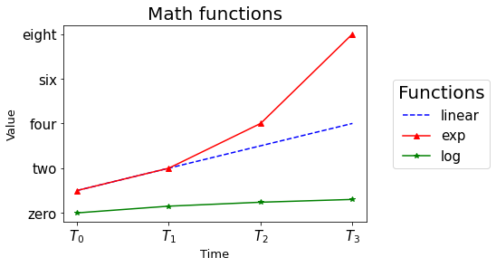

# UniBS Utilities
## Description
A python package that contains utility function on plots, tables and file management.

## Install Instructions
To install this python package run this command in your command line:
```shell
$ python setup.py install
```

## Modules
### plots

A module for creating customized plots from a dataset

#### methods:
* `get_line_plot`: returns a line plot of a dataset
* `get_hist_plot`: returns a bar plot of a dataset
* `set_size`: set a predefined size ('small', 'medium', 'big') to a numerical value
* `get_size`: get a predefined size numerical value
* `set_dimension`: set a `matplotlib.plotly` parameter to a certain predefined size

#### example:

Create a line plot of a given dataset

```python
import utils_unibs.plots as up
from utils_unibs.constants import C

dataset = [
    [1, 2, 3, 4], 
    [1, 2, 4, 8], 
    [0, 0.301, 0.477, 0.602]
]

colors = [
    "blue", 
    "red", 
    "green"
]

styles = [
    "--", 
    "-", 
    "-"
]

markers = [
    None, 
    "^", 
    "*"
]

labels = [
    "linear", 
    "exp", 
    "log"
]

up.set_dimension(dimension="axes label", value="small")
up.set_dimension(dimension="legend title", value="big")
up.set_size("small", 13)

fig, ax = up.get_line_plot(
    dataset=dataset,
    xticks=range(4),
    xticks_labels=["$T_0$", "$T_1$", "$T_2$", "$T_3$"],
    yticks=range(0,9,2),
    yticks_labels = ["zero", "two", "four", "six", "eight"],
    labels=labels,
    xlabel="Time",
    ylabel="Value",
    legend_title="Functions",
    title="Math functions",
    save_fig=None,
    colors=colors,
    styles=styles,
    markers=markers,
)
```



### tables
 A module for creating tables from a dataset
 
#### methods:
 * `print_latex_table`: creates a latex table of a dataset
 * `print_text_table`: creates a text table of a dataset
 * `transpose_latex_table`: transpose a latex table

#### example
Create a latex table of a given dataset and highlight the maximum value every two values in the same row
```python
import utils_unibs.tables as ut
from utils_unibs.constants import C

dataset = [
    [5, 4, 2, 3],
    [9, 6, 9, 6],
    [1, 0.3, 0.4, 0.6]
]

labels = [
    "Attempt 1",
    "Attempt 2",
    "Attempt 3",
]

print(
    ut.print_latex_table(
        dataset=dataset,
        labels=labels,
        best=C.MAX,
        axis=C.ROW,
        count_vals=2,
        precision=0,
        hline=2
    )
)
```
```
Attempt 1 & \bf{5} & 4 & 2 & \bf{3} \\ 
Attempt 2 & \bf{9} & 6 & \bf{9} & 6 \\ \hline
Attempt 3 & \bf{1} & 0 & 0 & \bf{1} \\ 
```

### files
A module for loading and saving files. Supports txt, pddl, json and pickle files

#### methods:
* `load_from_folder`: load files from a given folder
* `save_file`: Saves a given object in a file

#### example:
Load files from the folder `dir`


<samp>
|-- dir <br>
&nbsp;&nbsp;&nbsp;&nbsp;&nbsp;|-- file1<br>
&nbsp;&nbsp;&nbsp;&nbsp;&nbsp;|-- file2.json<br>
&nbsp;&nbsp;&nbsp;&nbsp;&nbsp;|-- file3.txt
</samp>

```python
import utils_unibs.files as uf

[f1, fnf, f2, f3] = uf.load_from_folder("dir", ["file1", "file_not_in_folder",  "file2.json", "file3.txt"])
```
```  
file1 loaded from dir
Could not load file_not_in_folder from dir
file2.json loaded from dir
file3.txt loaded from dir
```